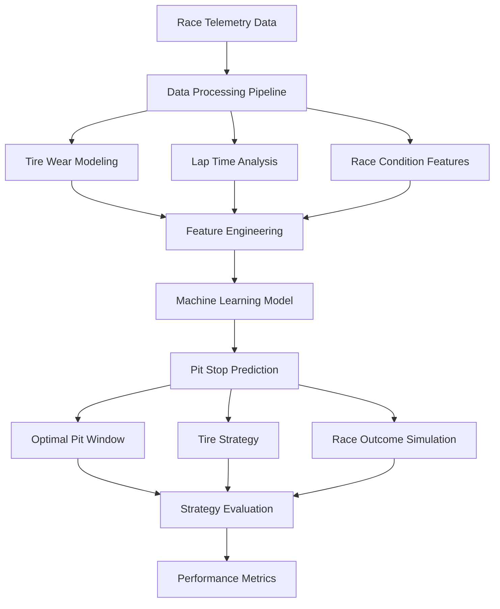
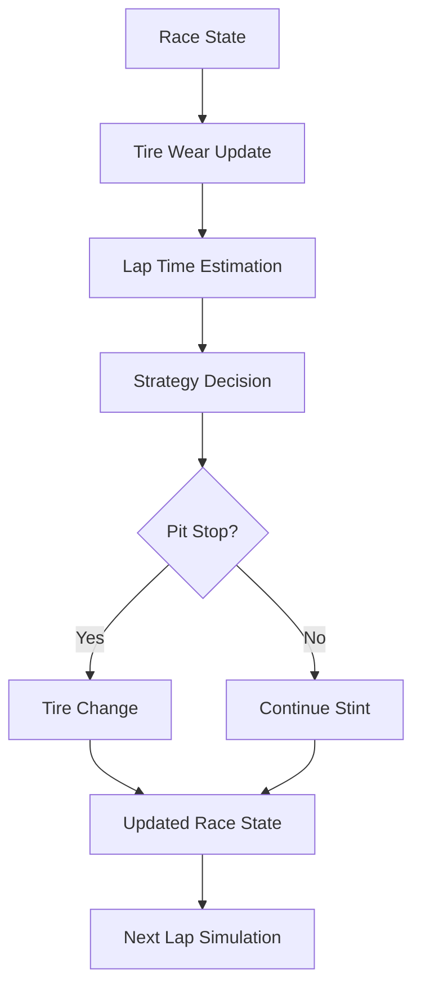
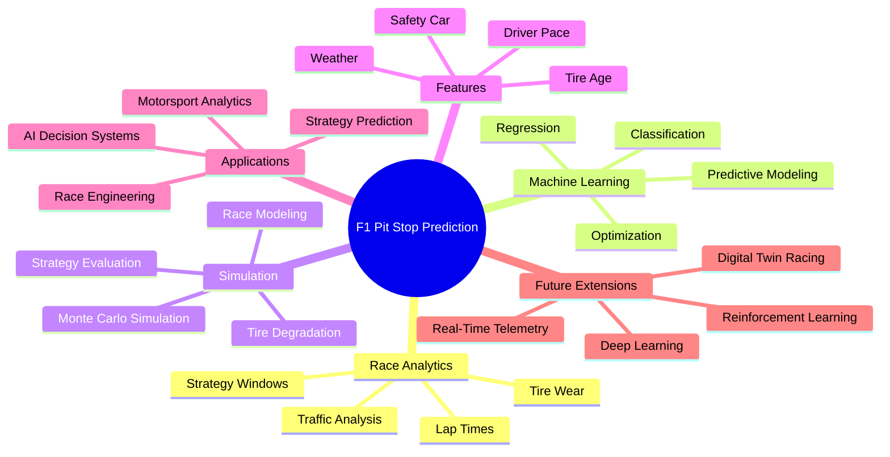

# Predicting F1 Pit Stops

## Overview

This project presents a machine learning and data-driven framework for predicting optimal Formula 1 pit stop strategies using race telemetry, tire degradation modeling, and race condition analysis. The repository focuses on leveraging predictive analytics, simulation methodologies, and intelligent strategy modeling to optimize pit stop timing and race performance.

The framework integrates motorsport analytics with machine learning workflows to analyze race dynamics, tire behavior, lap performance, and strategic decision-making under varying race conditions such as weather, traffic, and safety car periods.

The project is designed to provide scalable experimentation pipelines for F1 strategy prediction, enabling reproducible workflows for simulation, optimization, and predictive modeling.

---

# Kaggle Competition Performance

- Competition: Formula 1 Pit Stop Prediction Challenge
- Platform: Kaggle
- Final Rank: **231 / 2491**
- Focus Area:
  - Pit stop prediction
  - Tire degradation modeling
  - Race strategy optimization
  - Motorsport analytics

---

# Project Objectives

- Predict optimal pit stop windows
- Model tire degradation dynamics
- Analyze race pace evolution
- Simulate race strategy outcomes
- Improve strategic race decision-making
- Develop interpretable machine learning pipelines
- Enable scalable F1 race analytics experimentation

---

# Core Features

- F1 pit stop prediction framework
- Tire degradation modeling
- Race strategy optimization
- Dynamic lap-time analysis
- Traffic and race condition simulation
- Data-driven performance evaluation
- Machine learning-based prediction pipelines
- Motorsport analytics visualization

---

# System Architecture



---

# Workflow Pipeline


---

# Key Components

## 1. Data Processing Pipeline

The system processes multiple race-related variables including:

- Tire compound information
- Tire degradation rates
- Lap times
- Driver pace evolution
- Traffic conditions
- Safety car periods
- Weather conditions

The preprocessing pipeline ensures consistent and structured race telemetry representation for downstream predictive modeling.

---

## 2. Tire Degradation Modeling

The framework models tire wear progression over race stints:

```math
y = y_0 e^{-kt}
```

Where:

- $y$ = Tire performance
- $y_0$ = Initial tire performance
- $k$ = Degradation coefficient
- $t$ = Race laps or stint duration

This enables:

- Tire life estimation
- Performance drop analysis
- Optimal pit timing prediction
- Compound strategy evaluation

---

# Tire Strategy Pipeline


---

## 3. Machine Learning Prediction Framework

The project uses machine learning models to predict pit stop decisions based on race-state variables.

The probabilistic prediction process can be formulated as:

```math
P(pit \mid x) = f(x_1, x_2, x_3, ..., x_n)
```

Where:

- $x_i$ represents race-state features
- $P(pit \mid x)$ represents pit stop probability

Features may include:

- Tire age
- Lap number
- Current position
- Gap to competitors
- Traffic intensity
- Weather conditions
- Safety car probability

---

## 4. Lap Time Prediction

The framework estimates lap-time evolution under varying race conditions:

```math
y = mx + b
```

Where:

- $y$ = Predicted lap time
- $x$ = Tire wear / race progression
- $m$ = Performance degradation rate
- $b$ = Baseline pace

This allows:

- Pace forecasting
- Stint performance estimation
- Strategy comparison
- Race simulation analysis

---

# Mathematical Formulation

## Prediction Objective

The learning objective minimizes prediction error:

```math
\mathcal{L} = \frac{1}{N} \sum_{i=1}^{N}(y_i - \hat{y}_i)^2
```

Where:

- $y_i$ = Actual pit stop decision or lap time
- $\hat{y}_i$ = Predicted value
- $N$ = Number of samples

---

## Optimization Objective

The strategy optimization objective can be represented as:

```math
\min \sum_{t=1}^{T} \text{LapTime}_t + \text{PitLoss}
```

Subject to:

- Tire degradation constraints
- Mandatory tire regulations
- Race condition dynamics

---

# Race Simulation Architecture



---

# Feature Engineering

Key engineered features include:

- Tire age
- Tire compound encoding
- Average stint pace
- Lap delta trends
- Driver consistency
- Pit stop history
- Track characteristics
- Weather influence
- Traffic intensity
- Safety car probability

---

# Evaluation Metrics

The repository evaluates:

- Prediction accuracy
- Mean Absolute Error (MAE)
- Root Mean Squared Error (RMSE)
- Strategy efficiency
- Race outcome improvement
- Tire degradation estimation quality

---

# Motorsport Analytics Mindmap



---

# Applications

This framework can be applied to:

- Formula 1 race strategy optimization
- Motorsport analytics systems
- AI-assisted race engineering
- Predictive sports analytics
- Race simulation platforms
- Telemetry intelligence systems
- Autonomous strategy recommendation systems

---

# Future Extensions

Potential future improvements include:

- Reinforcement learning-based race agents
- Real-time telemetry integration
- Deep learning sequence models
- Monte Carlo race simulations
- Weather-aware strategy optimization
- Multi-agent race strategy systems
- Digital twin race simulations

---

# Design Principles

## Data-Driven Decision Making

The project emphasizes:

- Interpretable strategy prediction
- Statistical race analysis
- Predictive optimization
- Motorsport intelligence

---

## Scalability

The framework supports:

- Large-scale telemetry analysis
- Modular experimentation
- Flexible model integration
- Future real-time deployment

---

## Modularity

Clear separation between:

- Data preprocessing
- Feature engineering
- Modeling
- Simulation
- Evaluation
- Visualization

---

# Key Takeaways

- Tire degradation strongly influences race outcomes
- Data-driven pit strategies improve race performance
- Predictive analytics enhances race decision-making
- Machine learning enables scalable motorsport intelligence
- Simulation pipelines improve strategy evaluation efficiency

---

# External Resources

- GitHub Repository: https://github.com/start-again-06/Predicting_F1_Pit_Stops
- Formula 1 Official Website: https://www.formula1.com
- FastF1 Library: https://theoehrly.github.io/Fast-F1/

---

# License

By Anjan Mahapatra.

This project is intended for educational, research, and motorsport analytics purposes.

Refer to applicable licenses for associated datasets, APIs, machine learning libraries, and Formula 1 telemetry resources.
