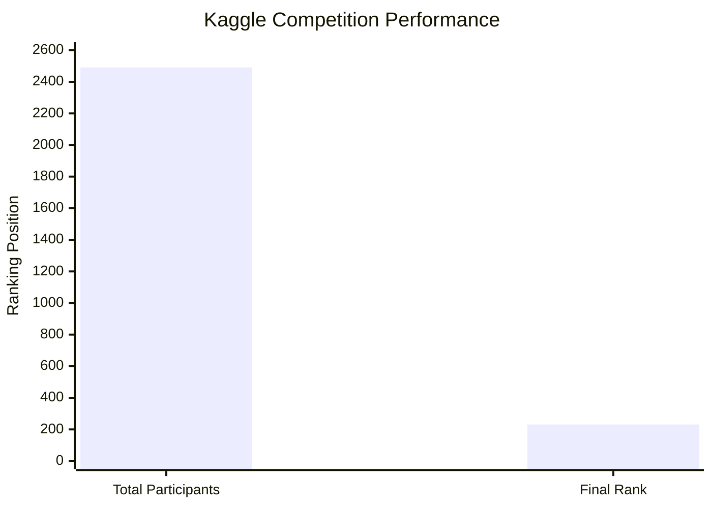
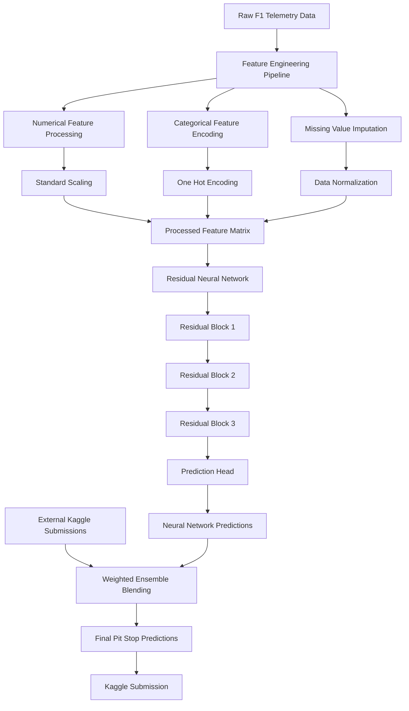
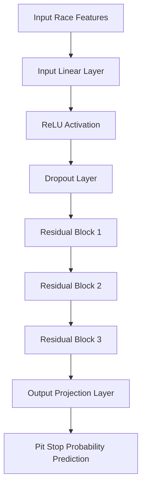
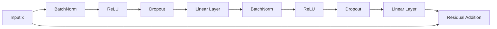
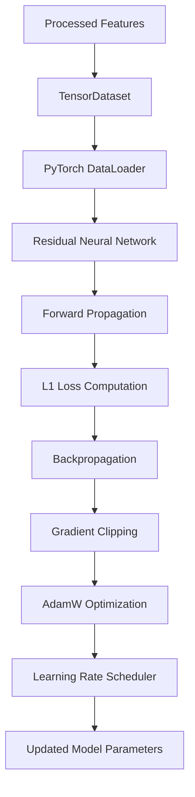
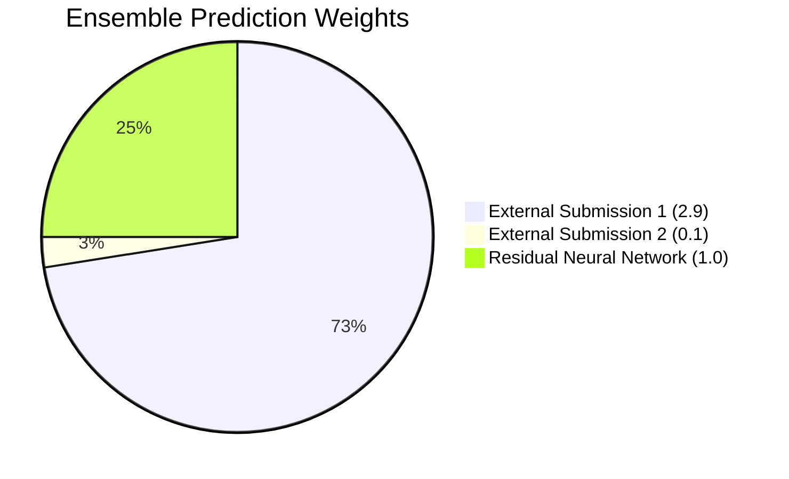
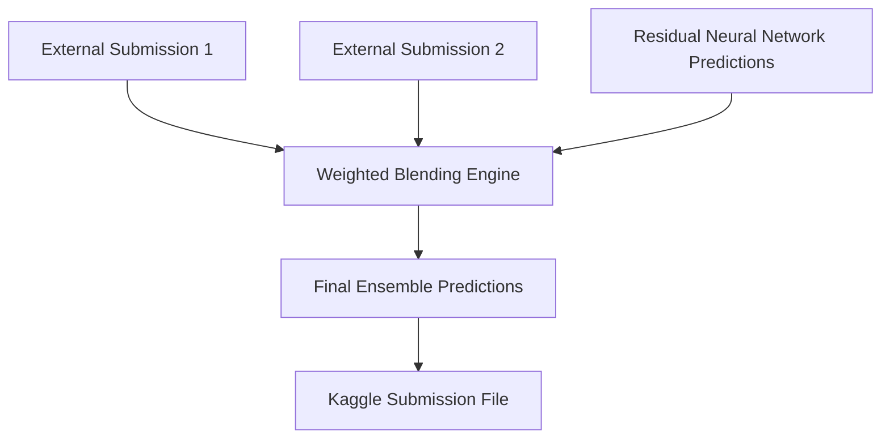
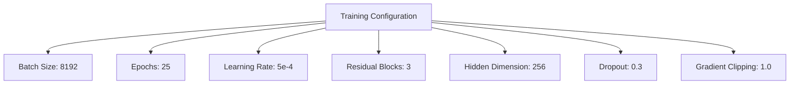
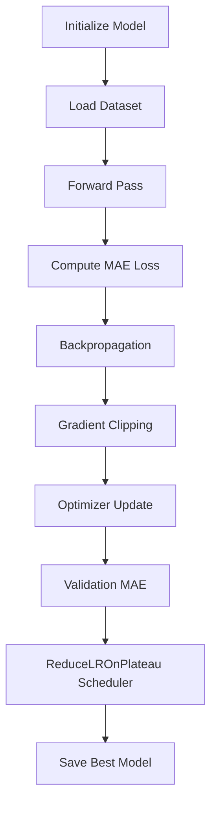
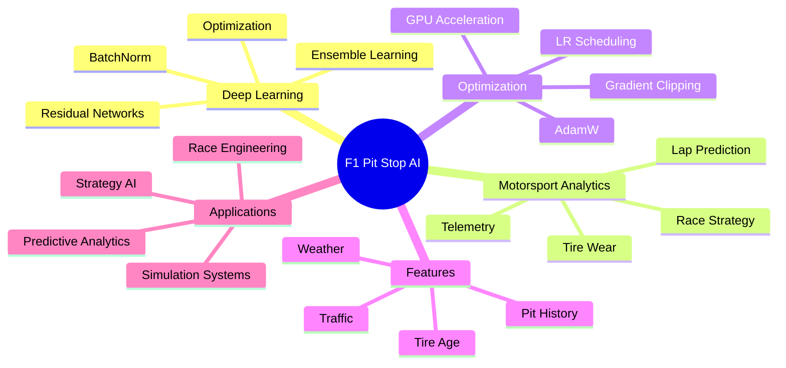

# Predicting F1 Pit Stops

## Overview

This project presents a comprehensive machine learning and deep learning framework for predicting optimal Formula 1 pit stop strategies using race telemetry, tire degradation behavior, race-state dynamics, and strategic motorsport analytics. The repository focuses on leveraging modern AI methodologies, predictive analytics, residual neural networks, and ensemble learning systems to optimize pit stop timing and improve race strategy decision-making under highly dynamic racing conditions.

Formula 1 strategy engineering is an extremely data-intensive domain where milliseconds determine race outcomes. Tire degradation, fuel load, race pace evolution, track temperature, weather transitions, safety car deployment, driver consistency, traffic management, and undercut/overcut strategies all influence pit stop timing decisions. This project aims to model those interactions using scalable deep learning pipelines capable of learning non-linear race dynamics from structured telemetry and race-state data.

The framework integrates:

- Motorsport telemetry analytics
- Deep residual neural networks
- Structured tabular deep learning
- Advanced preprocessing pipelines
- Weighted ensemble blending
- GPU-accelerated PyTorch training
- Adaptive optimization strategies
- Learning rate scheduling
- Gradient clipping stabilization
- Large-batch inference optimization

The repository is designed to provide reproducible workflows for:

- F1 race strategy prediction
- Pit stop timing optimization
- Tire degradation modeling
- Telemetry-driven race analytics
- Ensemble prediction systems
- Deep learning experimentation for motorsport AI

The project achieved a strong competitive performance on Kaggle by combining deep residual learning with weighted ensemble blending techniques for improved leaderboard stability and generalization.

---

# Kaggle Competition Performance

- Competition: Formula 1 Pit Stop Prediction Challenge
- Platform: Kaggle
- Final Rank: **231 / 2491**
- Competition Domain:
  - Motorsport Analytics
  - Formula 1 Strategy Optimization
  - Telemetry-Based Prediction
  - Deep Learning for Structured Data

---

# Competition Performance Visualization



---

# Project Objectives

The primary objectives of the project include:

- Predict optimal Formula 1 pit stop timing
- Model tire degradation and stint performance
- Analyze race-state evolution dynamically
- Improve strategic race decision-making
- Optimize leaderboard generalization performance
- Build scalable deep learning pipelines
- Implement robust ensemble learning systems
- Develop GPU-accelerated training workflows
- Improve prediction stability under noisy conditions
- Explore deep residual learning for tabular telemetry data

---

# Key Highlights

The project incorporates multiple modern machine learning and deep learning optimization strategies:

- Residual Neural Network Architecture
- Deep Residual Learning Blocks
- Batch Normalization Stabilization
- ReLU Nonlinear Activations
- Dropout Regularization
- Xavier Weight Initialization
- GPU Accelerated PyTorch Training
- Adaptive Learning Rate Scheduling
- AdamW Optimization
- Gradient Clipping Stabilization
- Weighted Ensemble Blending
- Feature Scaling Pipelines
- Categorical Encoding Pipelines
- Large-Batch Deep Learning
- Efficient Tensor-Based Data Pipelines
- Non-blocking GPU Memory Transfers
- Memory-Optimized Training Loops

These components collectively improve:

- Model convergence
- Training stability
- Generalization capability
- Prediction robustness
- Computational scalability
- Leaderboard consistency

---

# Overall System Architecture



---

# Residual Neural Network Framework

## Deep Residual Learning Architecture

The project uses a custom deep residual neural network architecture specifically optimized for structured motorsport telemetry data and tabular race-state features.

Residual learning is particularly useful for deep architectures because it enables improved gradient propagation across multiple hidden layers, reducing optimization instability and improving convergence.

The network architecture includes:

- Input Projection Layers
- Residual Learning Blocks
- Batch Normalization Layers
- ReLU Activation Functions
- Dropout Regularization
- Linear Projection Layers
- Residual Skip Connections
- Optimized Output Layers

---

# Neural Network Architecture



---

# Residual Block Architecture

The residual block is the core building unit of the neural network. It stabilizes training while enabling deeper feature extraction and non-linear representation learning.



---

# Mathematical Representation of Residual Learning

Residual mapping can be represented as:

```math
H(x) = F(x) + x
```

Where:

- $x$ = Input representation
- $F(x)$ = Learned residual mapping
- $H(x)$ = Final transformed representation

Residual learning improves:

- Gradient flow
- Feature reuse
- Optimization stability
- Convergence speed
- Deep representation learning

---

# Data Processing Pipeline

The preprocessing system is designed to efficiently handle structured Formula 1 telemetry and race-state data.


---

# Core Features Used

The model processes multiple motorsport-specific race-state variables including:

- Tire age
- Tire compound
- Driver pace evolution
- Lap number
- Race position
- Pit stop history
- Traffic density
- Gap to competitors
- Stint length
- Weather conditions
- Safety car influence
- Race telemetry indicators
- Historical race dynamics
- Strategic race-state variables

These features collectively help the model understand:

- Tire degradation trends
- Race pace transitions
- Pit stop opportunities
- Strategic undercut windows
- Race evolution patterns

---

# Numerical Feature Processing

The framework applies robust preprocessing pipelines to numerical telemetry data.

The preprocessing includes:

- Median Imputation
- Standardization
- Feature Normalization

Standardization is defined as:

```math
z = \frac{x - \mu}{\sigma}
```

Where:

- $x$ = Original feature
- $\mu$ = Mean value
- $\sigma$ = Standard deviation

This improves:

- Numerical stability
- Gradient optimization
- Training convergence
- Feature consistency

---

# Categorical Feature Processing

Categorical motorsport features are processed using:

- Most Frequent Imputation
- One-Hot Encoding

This enables robust representation learning for:

- Tire compounds
- Driver categories
- Track states
- Team-specific information
- Race conditions

---

# Deep Learning Training Pipeline



---

# Loss Function

The project minimizes Mean Absolute Error (MAE), which is robust to noisy targets and improves prediction stability.

```math
\mathcal{L}_{MAE} =
\frac{1}{N}
\sum_{i=1}^{N}
|y_i - \hat{y}_i|
```

Where:

- $y_i$ = Ground truth target
- $\hat{y}_i$ = Predicted target
- $N$ = Number of training samples

---

# Optimization Strategy

The framework combines multiple optimization strategies:

- AdamW Optimizer
- Weight Decay Regularization
- Adaptive Learning Rate Scheduling
- Gradient Clipping
- Batch Normalization Stabilization

Gradient clipping stabilizes optimization:

```math
g = \min(g, \tau)
```

Where:

- $g$ = Gradient magnitude
- $\tau$ = Clipping threshold

This reduces:

- Gradient explosion
- Optimization instability
- Numerical divergence

---

# Ensemble Blending Strategy

The final leaderboard solution combines:

- External Kaggle model submissions
- Residual Neural Network predictions

Weighted ensemble formulation:

```math
P_{final} =
\sum_{i=1}^{N}
w_i P_i
```

Where:

- $P_i$ = Individual model prediction
- $w_i$ = Ensemble weight

---

# Ensemble Weight Distribution



---

# Ensemble Architecture



---

# Training Configuration

| Component | Configuration |
|---|---|
| Framework | PyTorch |
| Hidden Dimension | 256 |
| Residual Blocks | 3 |
| Batch Size | 8192 |
| Epochs | 25 |
| Optimizer | AdamW |
| Scheduler | ReduceLROnPlateau |
| Learning Rate | 5e-4 |
| Dropout | 0.3 |
| Loss Function | L1 Loss |
| Gradient Clipping | 1.0 |

---

# Training Configuration Visualization



---

# Training Workflow



---

# GPU Optimization Techniques

The implementation incorporates multiple GPU optimization strategies including:

- CUDA acceleration
- cuDNN benchmarking
- TF32 matrix operations
- Large-batch inference optimization
- Non-blocking memory transfers
- Memory-efficient tensor pipelines
- Optimized PyTorch DataLoaders

These optimizations significantly improve:

- Training throughput
- Computational efficiency
- GPU utilization
- Inference latency
- Scalability for large telemetry datasets

---

# Evaluation Metrics

The repository evaluates multiple performance indicators:

- Mean Absolute Error (MAE)
- Prediction robustness
- Validation consistency
- Ensemble stability
- Generalization capability
- Leaderboard performance

---

# Motorsport AI Mindmap



---

# Applications

This framework can be applied to multiple domains including:

- Formula 1 race strategy optimization
- Motorsport telemetry analytics
- AI-assisted race engineering
- Predictive pit strategy systems
- Real-time racing simulations
- Sports analytics pipelines
- Autonomous strategy recommendation systems
- Race-state forecasting systems
- Telemetry intelligence platforms

---

# Future Improvements

Potential future research directions include:

- Transformer-based telemetry modeling
- Attention-based sequence learning
- Temporal race-state transformers
- Reinforcement learning race agents
- Monte Carlo race simulation
- Real-time telemetry inference
- Graph neural networks for racing interactions
- Multi-model stacking ensembles
- Digital twin race simulations
- Probabilistic strategy forecasting

---

# Key Takeaways

- Residual learning improves deep tabular modeling
- Ensemble learning enhances leaderboard robustness
- GPU acceleration enables scalable experimentation
- Deep learning can effectively model race strategies
- Structured preprocessing improves convergence stability
- Large-batch optimization accelerates training efficiency
- Weighted blending improves generalization performance

---

# External Resources

- GitHub Repository: https://github.com/start-again-06/Predicting_F1_Pit_Stops
- Formula 1 Official Website: https://www.formula1.com
- PyTorch Framework: https://pytorch.org
- FastF1 Library: https://theoehrly.github.io/Fast-F1/

---

# License

By Anjan Mahapatra.

This project is intended for educational, research, and motorsport analytics purposes.

Refer to applicable licenses for associated datasets, APIs, PyTorch, and Formula 1 telemetry resources.
